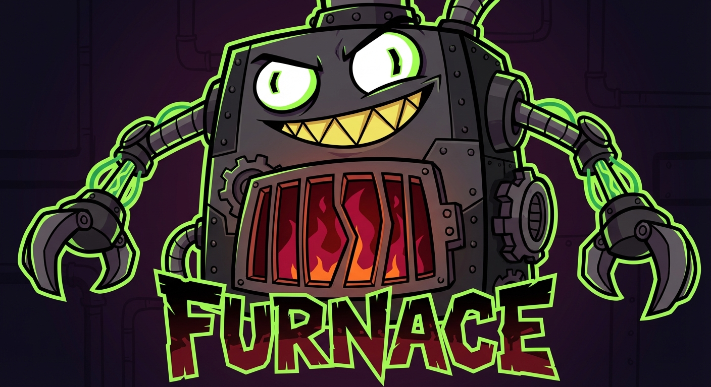

# 🔥 Furnace

<p align="center">
  
</p>

<p align="center">
  <strong>AI-Powered Semantic Rust Code Analyzer with 10 Output Styles</strong>
</p>

<p align="center">
  <a href="https://www.rust-lang.org/"></a>
  <a href="#"></a>
  <a href="LICENSE"></a>
</p>

Furnace is an elite-tier CLI tool that goes beyond simple file walking to provide intelligent, semantic analysis of Rust projects. With 10 distinct output aesthetics, optional AI-powered insights, and beginner-friendly explanations, it serves everyone from vibe coders to senior architects.

## ✨ Key Features

- **🎨 10 Output Aesthetics**: Plain, Tree, Compact, Verbose, Minimal, Grid, Markdown, HTML, Badges, Monochrome
- **🔧 Composable Design**: Mix and match layout, detail, color, and symbol options
- **🧠 Semantic Traversal**: Understands Cargo workspaces and module hierarchies
- **🤖 AI-Powered Analysis**: Optional GPT-4/Gemini integration for code review
- **🎓 Layman Mode**: Explains code in simple terms for beginners
- **📊 Granular Linting**: Categorized, opt-in lints (complexity, naming, style)
- **🧪 Comprehensive Testing**: 21 tests covering all features
- **🚀 Production-Ready**: Workspace-aware, incremental-ready, parallel processing

## 🎬 Visual Demos

### Tree Output (with emojis)


### Plain Output (grep-able)


*See `demos/` for more examples*

## 🚀 Quick Start

### Installation

```bash
# Clone repository
git clone https://github.com/elci-group/furnace
cd furnace

# Run installer (builds and installs to /usr/local/bin)
./install.sh
```

The installer will:
- Build furnace in release mode
- Install to `/usr/local/bin` (or `~/.local/bin` if no sudo access)
- Make it globally available as `furnace`

### Basic Usage

```bash
# Analyze current directory with tree view
furnace .

# Use different styles
furnace . --plain     # Simple text
furnace . --tree      # Hierarchical with emojis (default)
furnace . --grid      # Table layout
furnace . --compact   # Dense format

# Compose styles
furnace . --tree --detail verbose
furnace . --layout grid --color standard

# JSON output for tooling
furnace . --format json

# Analyze specific project
furnace /path/to/rust/project --tree
```

### AI Features (Optional)

```bash
# Build with AI support
cargo build --release --features ai
./install.sh

# Technical code review
export OPENAI_API_KEY="sk-..."
furnace . --ai-lint --tree

# Layman explanations for beginners
furnace . --layman=openai

# Use Google Gemini instead
export GOOGLE_API_KEY="..."
furnace . --layman=google
```

## 📊 Output Styles

| Style | Flag | Description | Use Case |
|-------|------|-------------|----------|
| **Plain** | `--plain` | Simple text, no colors | CI/CD, scripts, grep |
| **Tree** | `--tree` | Hierarchical with emojis | Interactive exploration |
| **Compact** | `--compact` | Dense, minimal whitespace | Quick overview |
| **Verbose** | `--verbose` | Extra details (args, vars) | Deep inspection |
| **Minimal** | `--minimal` | Names only | Ultra-minimal |
| **Grid** | `--grid` | ASCII table layout | Stats comparison |
| **Markdown** | `--markdown` | Markdown-formatted | Documentation |
| **HTML** | `--html` | HTML-ready output | Web rendering |
| **Badges** | `--badges` | With emoji badges | Visual reports |
| **Monochrome** | `--monochrome` | No colors, symbols only | No-color terminals |

## 🎛️ Composable Modifiers

Customize any preset with orthogonal modifiers:

```bash
--layout [plain|tree|grid|compact]
--detail [minimal|standard|verbose]
--color [none|standard|badges]
--symbols [none|ascii|unicode]
```

**Example combinations:**
```bash
# Tree layout with minimal detail
furnace . --tree --detail minimal

# Grid with colors
furnace . --layout grid --color standard

# Custom: plain layout + verbose + badges
furnace . --layout plain --detail verbose --color badges
```

## 🧹 Linting

Furnace supports granular, opt-in linting organized into categories:

### Configuration (`.furnacerc.toml`)

```toml
[lints]
enabled = true

[lints.complexity]
max_args = 7
max_fields = 15

[lints.naming]
enforce_snake_case_functions = true
enforce_snake_case_variables = true
enforce_pascal_case_types = true
discouraged_names = ["foo", "bar", "temp"]

[lints.ai]  # Requires --features ai
enabled = false
provider = "openai"
model = "gpt-4"
```

See `.furnacerc.toml.example` for all options.

## 🤖 AI Integration

### Technical Analysis (`--ai-lint`)

Provides:
- Architecture insights
- Code quality suggestions
- Anti-pattern detection
- Quality scoring (0-100)

**Batched for efficiency**: Entire project analyzed in one API call!

### Layman Explanations (`--layman`)

Perfect for:
- Onboarding new developers
- Learning Rust
- Understanding unfamiliar codebases
- "Vibe coders" exploring projects

**Example output:**
```
🎓 The engine.rs file is like a detective 🕵️ that explores your code
project. Instead of just looking at files like a file browser, it
understands the structure - it knows which files are connected...
```

## 🏗️ Architecture

### Semantic Graph Model

Furnace treats codebases as structured graphs, not file trees:

```
ProjectGraph
├── Crate (from Cargo.toml)
│   └── Module
│       ├── File
│       │   ├── Functions
│       │   ├── Structs
│       │   └── Enums
│       └── Submodules (recursive)
```

This enables:
- Workspace-aware traversal
- Automatic `target/` exclusion
- Module hierarchy understanding
- Foundation for incremental caching

### Key Components

- **`engine.rs`**: Semantic traversal engine
- **`graph.rs`**: Project graph data structures
- **`output.rs`**: 10 aesthetic renderers
- **`ai_linting.rs`**: AI integration (optional)
- **`linting.rs`**: Traditional static lints

## 🧪 Testing

```bash
# All tests (21 passing)
cargo test

# Output rendering tests
cargo test --test output_test

# Integration tests
cargo test --test integration_test
```

**Test Coverage:**
- 4 unit tests (config, visitor)
- 7 integration tests (engine, traversal)
- 10 output rendering tests

## 📈 Performance

**Benchmarks** (Furnace analyzing itself):
- Scan time: ~0.2-0.3s
- Binary size: 8MB (without AI), 12MB (with AI)
- Memory: Minimal (graph construction is lightweight)

## 🎯 Use Cases

1. **Code Review**: `furnace . --ai-lint` for automated insights
2. **Onboarding**: `furnace . --layman` for beginner-friendly explanations
3. **CI/CD**: `furnace . --compact --format json` for automated checks
4. **Documentation**: `furnace . --tree` or `furnace . --grid` for README snippets
5. **Learning**: Explore unfamiliar codebases with AI explanations

## 🛠️ Development

### Running Demos

```bash
cd demos
./record_all.sh  # Requires VHS: https://github.com/charmbracelet/vhs
```

### Project Structure

```
furnace/
├── src/
│   ├── main.rs          # CLI entry point
│   ├── lib.rs           # Library exports
│   ├── engine.rs        # Semantic traversal
│   ├── graph.rs         # Graph data structures
│   ├── output.rs        # Output renderers
│   ├── ai_linting.rs    # AI integration (optional)
│   ├── linting.rs       # Static lints
│   ├── types.rs         # Snapshot types
│   ├── visitor.rs       # AST visitor
│   └── config.rs        # Configuration
├── tests/
│   ├── integration_test.rs
│   └── output_test.rs
├── demos/               # VHS recordings
└── .furnacerc.toml.example
```

## 🌟 Why Furnace?

Most Rust analysis tools are either:
- Too simple (just file walking)
- Too complex (full LSP servers)
- Single-purpose (only linting or only visualization)

**Furnace is different:**
- ✅ Semantic understanding (not just grep)
- ✅ Multiple use cases (analysis, education, CI/CD)
- ✅ Flexible output (10 styles + composability)
- ✅ AI-enhanced (optional, context-aware)
- ✅ Beginner-friendly (layman mode is unique!)

## 📚 Documentation

- [Feature Demos](./demos/README.md) - Visual demonstrations
- [Configuration Guide](./.furnacerc.toml.example) - All linting options
- [Architecture Overview](./ARCHITECTURE.md) - Design decisions (*coming soon*)

## 🤝 Contributing

Contributions welcome! Areas for improvement:
- Additional output formats
- More lint rules
- Caching implementation
- Graph visualization export
- Additional AI providers

## 📄 License

MIT License - see [LICENSE](LICENSE) for details

## 🙏 Acknowledgments

- Built with [syn](https://github.com/dtolnay/syn) for AST parsing
- Uses [clap](https://github.com/clap-rs/clap) for CLI
- Optional AI via [async-openai](https://github.com/64bit/async-openai)
- Demos created with [VHS](https://github.com/charmbracelet/vhs)

---

**⭐ Star this repo if Furnace helped you understand your Rust codebase!**
